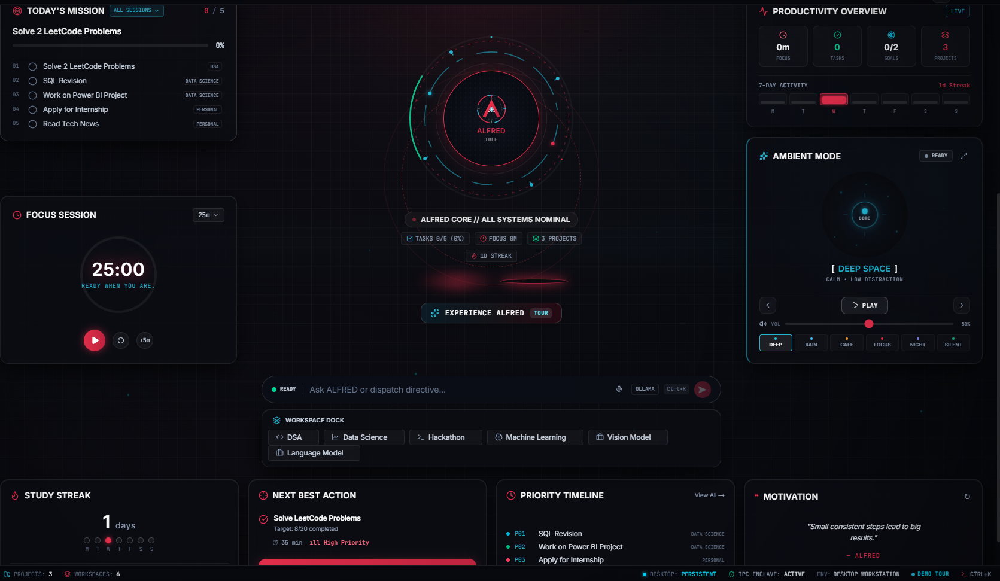
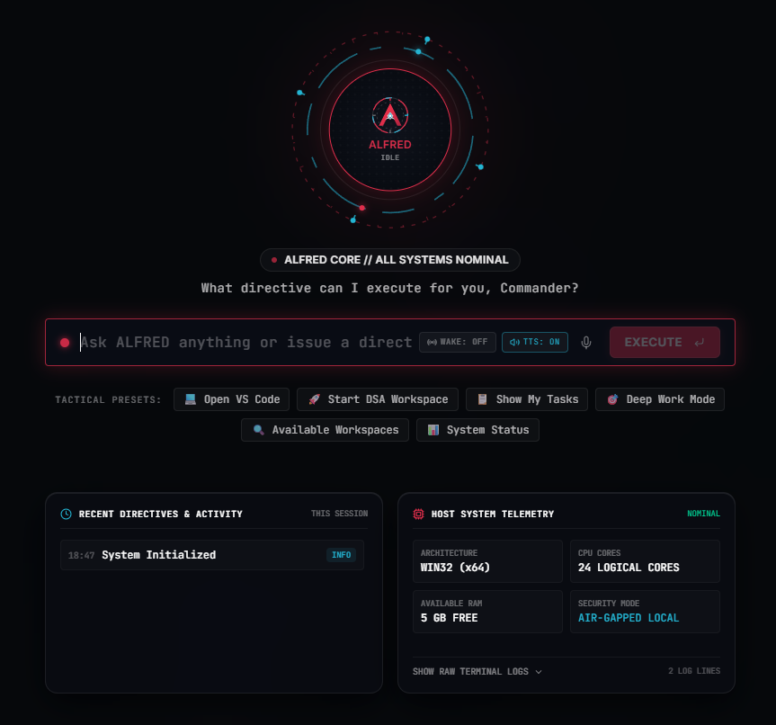
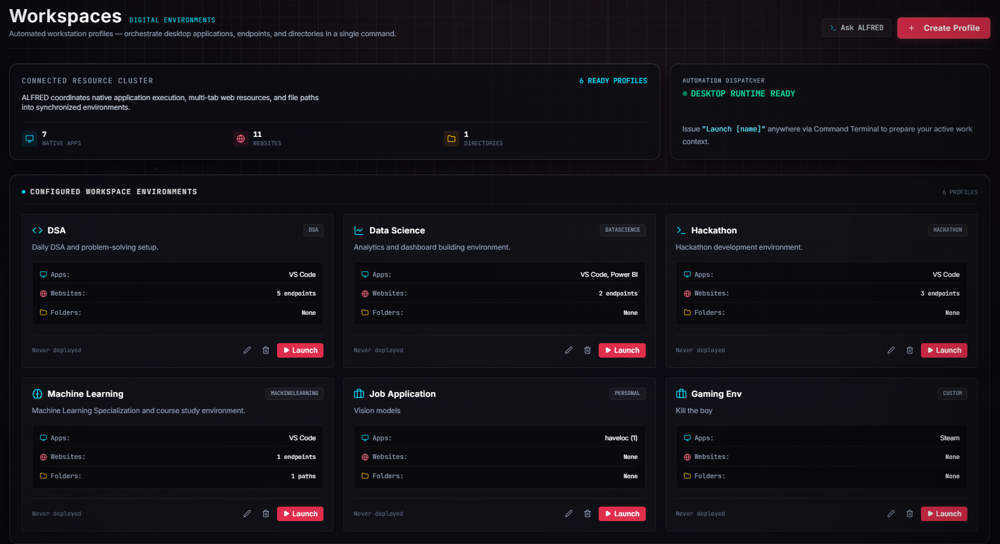
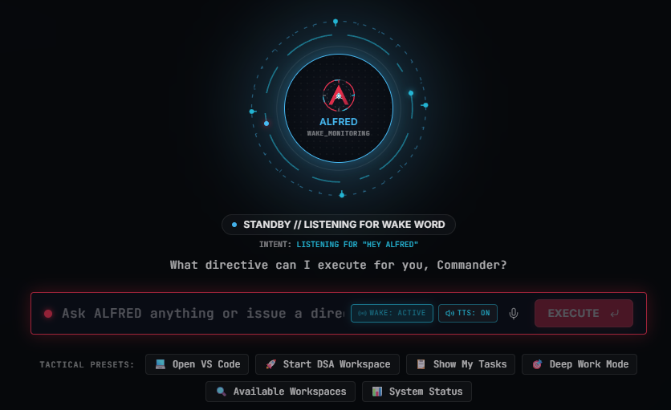
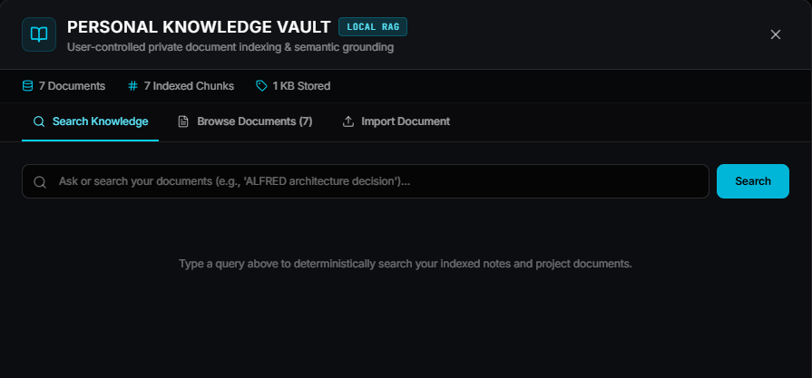
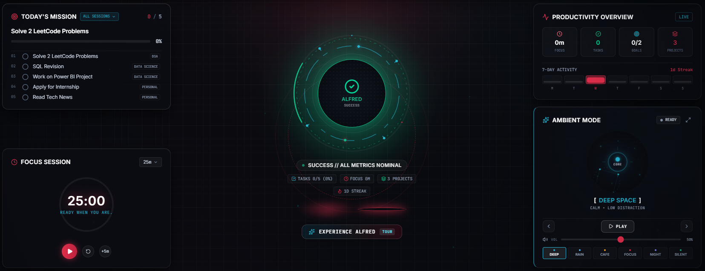
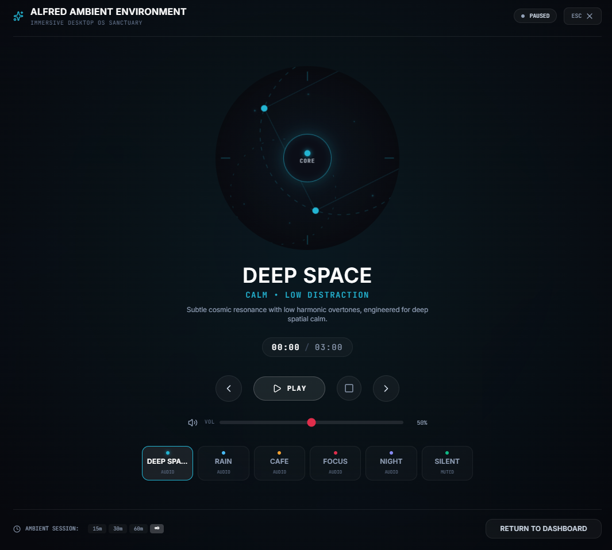
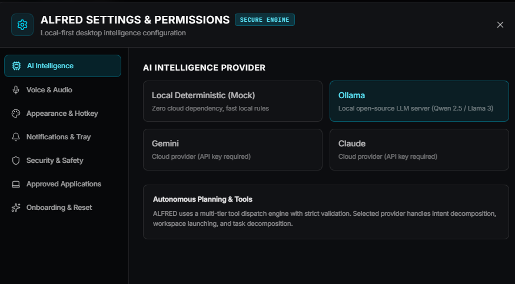

# ALFRED — Personal AI Desktop Assistant

<p align="center">
  <strong>Autonomous Local Framework & Executive Director</strong><br/>
  A local-first AI desktop assistant for command execution, workspace automation, deep work, voice interaction, knowledge retrieval, and personal productivity.
</p>

<p align="center">
  
</p>

<p align="center"><em>A cinematic desktop command center designed to make your computer feel like an intelligent workspace.</em></p>

---

## What is ALFRED?

ALFRED is a **Windows desktop AI assistant** built with **Electron, Next.js, React, and TypeScript**.

Instead of acting as another chat window, ALFRED connects natural-language instructions to a controlled set of desktop capabilities:

```text
User / Voice
      ↓
AI Provider
      ↓
Intent & Agent Planning
      ↓
Context + Risk Validation
      ↓
Confirmation / Permission Gate
      ↓
Tool Registry
      ↓
Electron / Windows
```

> **The AI can reason and request actions. ALFRED decides what is allowed to execute.**

---

## Why I Built It

Most AI assistants are optimized for conversation. I wanted to explore a different question:

**What would an AI assistant look like if it were designed around the desktop itself?**

ALFRED combines:

- AI-assisted command understanding
- Native Windows application launching
- Workspace automation
- Voice interaction and wake-word detection
- Local knowledge retrieval
- Personal memory
- Focus and productivity workflows
- Scheduled and conditional routines
- Ambient environments for deep work
- Security and permission boundaries

The project evolved from a productivity dashboard into a full **local-first desktop assistant**.

---

# Core Capabilities

## 🤖 Agentic Desktop Control

Give ALFRED natural-language commands instead of navigating through menus.

```text
"Open VS Code"

"Launch my Machine Learning workspace"

"Show my tasks"

"Start Deep Work Mode"

"Open my Data Science environment"
```

Commands are interpreted by the agent layer and dispatched through registered tools rather than allowing the model to execute arbitrary shell commands.

<p align="center">
  
</p>

---

## 🖥️ Workspace Automation

ALFRED organizes applications, websites, and directories into reusable **workspace profiles**.

Examples:

- DSA
- Data Science
- Machine Learning
- Hackathon
- Job Application
- Custom workspaces

A workspace can contain native Windows applications, websites, and local directories, allowing an entire work environment to be launched from one command.

<p align="center">
  
</p>

---

## 🎙️ Voice Interface & Wake Word

ALFRED supports a local voice pipeline using:

- Local Whisper speech-to-text
- OpenWakeWord
- Voice activity detection
- Windows SAPI text-to-speech

The wake-word flow allows ALFRED to remain in a standby state and transition into command capture after detecting **"Hey Alfred"**.

<p align="center">
  
</p>

---

## 🧠 Multi-Provider AI

ALFRED supports multiple reasoning backends:

| Provider | Purpose |
|---|---|
| Mock | Deterministic offline testing |
| Ollama | Local LLM inference |
| Gemini | Cloud-based reasoning |
| Claude | Cloud provider architecture |

Provider selection is separated from the execution layer so the same agent/tool architecture can work with different models.

---

## 🛡️ Secure Tool Execution

One of the most important architectural decisions in ALFRED is that **LLMs do not directly control the operating system**.

```text
AI
 ↓
Agent Orchestrator
 ↓
Risk / Permission Policy
 ↓
Confirmation Store
 ↓
Tool Registry
 ↓
Secure Executor
 ↓
Windows
```

### Tool Registry

System operations are exposed as explicitly registered tools such as:

- Application Launcher
- Workspace Launcher
- URL Navigation
- Path Opening
- System Status
- Productivity Actions
- Knowledge / Memory Operations
- Deep Work Mode

The renderer does not receive unrestricted Node.js or shell access.

### Confirmation Store

State-changing operations can require explicit confirmation before execution.

Confirmations are:

- validated against the intended operation
- single-use
- time-limited
- handled by the main process

This creates a boundary between **AI reasoning** and **system execution**.

---

# 🧠 Local Knowledge Vault

ALFRED includes a local knowledge system for indexing project documents and retrieving relevant information.

<p align="center">
  
</p>

The knowledge layer is designed around:

- Local document ingestion
- Chunking and indexing
- BM25-style keyword retrieval
- Semantic grounding
- Project/workspace boundaries
- No external vector database requirement

Untrusted document content is treated as information rather than executable authority.

---

# 🧩 Memory & Personalization

ALFRED maintains explicit local memories that can be used to personalize future interactions.

Memory operations are controlled rather than allowing arbitrary model-generated persistence.

Sensitive patterns are filtered before storage.

---

# 🎯 Productivity & Deep Work

ALFRED combines AI assistance with a productivity layer containing:

- Today's Mission
- Tasks
- Goals
- Projects
- Study Streak
- Focus Sessions
- Productivity Overview
- Priority Timeline
- Next Best Action
- Deep Work Mode

<p align="center">
  
</p>

The goal is not to create another task manager, but to let the assistant use productivity context when deciding what the user should work on next.

---

# 🌌 Ambient Mode

Ambient Mode turns ALFRED into an immersive deep-work environment.

Available environments include:

- Deep Space
- Rain
- Cafe
- Focus
- Night
- Silent

Each environment has its own visual identity and local audio track. The fullscreen experience is designed as a distraction-free desktop environment.

<p align="center">
  
</p>

---

# ⚙️ Settings & AI Providers

ALFRED includes a centralized settings and permissions interface for configuring:

- AI providers
- Voice & audio
- Appearance and hotkeys
- Notifications and tray behavior
- Security & safety
- Approved applications
- Onboarding and reset

<p align="center">
  
</p>

---

# 🏗️ Architecture

ALFRED uses Electron as the desktop authority and Next.js/React as the renderer.

```text
┌─────────────────────────────────────────────────────────────┐
│                        ALFRED DESKTOP                       │
├─────────────────────────────────────────────────────────────┤
│                                                             │
│  ┌──────────────────────┐      ┌─────────────────────────┐ │
│  │ Next.js / React      │      │ Electron Main Process   │ │
│  │                      │ IPC  │                         │ │
│  │ • Dashboard          │◄────►│ • Native Windows APIs   │ │
│  │ • Command Terminal   │      │ • Agent Orchestrator     │ │
│  │ • Workspaces         │      │ • Tool Registry          │ │
│  │ • Productivity       │      │ • Scheduler              │ │
│  │ • Knowledge UI       │      │ • Voice Services         │ │
│  │ • Settings           │      │ • Security / Permissions │ │
│  └──────────────────────┘      └────────────┬────────────┘ │
│                                             │              │
│                                   ┌─────────▼─────────┐    │
│                                   │ Approved Tools    │    │
│                                   ├───────────────────┤    │
│                                   │ App Launch        │    │
│                                   │ Workspace Launch  │    │
│                                   │ URLs / Paths      │    │
│                                   │ Productivity      │    │
│                                   │ Knowledge / Memory│    │
│                                   └─────────┬─────────┘    │
└─────────────────────────────────────────────┼──────────────┘
                                              ↓
                                     Windows Desktop
```

---

# 🧠 Agent Execution Flow

A typical command follows this path:

```text
"Launch my Machine Learning workspace"
                │
                ▼
        Command Understanding
                │
                ▼
         Agent Context Builder
                │
                ▼
        Plan / Intent Validation
                │
                ▼
          Risk Classification
                │
                ▼
       Confirmation if required
                │
                ▼
           Tool Registry
                │
                ▼
       Workspace Launch Tool
                │
                ▼
        Electron Native Layer
                │
                ▼
       Windows Applications
```

This architecture allows the AI provider to change without rewriting the execution layer.

---

# 🛡️ Security & Privacy

ALFRED is intentionally designed around local control and explicit execution boundaries.

### Renderer Isolation

Electron uses:

- `nodeIntegration: false`
- `contextIsolation: true`
- restricted IPC channels
- preload-based APIs

### Execution Boundaries

The AI provider does not receive unrestricted access to:

- `child_process`
- arbitrary shell commands
- `eval`
- arbitrary filesystem mutation

Native actions must pass through ALFRED's controlled execution architecture.

### Local-First Design

ALFRED stores application state and personal data locally rather than requiring a hosted backend.

Cloud AI providers are optional; local inference through Ollama is supported.

---

# 🧰 Tech Stack

| Layer | Technology |
|---|---|
| Desktop Runtime | Electron |
| Frontend | Next.js, React |
| Language | TypeScript |
| Styling | Tailwind CSS |
| Animation | Framer Motion |
| Icons | Lucide |
| Local LLM | Ollama |
| Cloud LLMs | Gemini, Claude |
| Speech-to-Text | Whisper |
| Wake Word | OpenWakeWord |
| Text-to-Speech | Windows SAPI |
| Retrieval | Local BM25 / semantic retrieval |
| Persistence | Local filesystem / application data |
| Testing | Jest / Electron smoke tests |
| Platform | Windows 10/11 |

---

# 📁 Project Structure

```text
alfred/
├── electron/
│   ├── agent/          # Agent orchestration, planning, tools & providers
│   ├── automation/     # Event bus & conditional automation
│   ├── config/         # Application configuration
│   ├── ipc/            # Secure IPC handlers
│   ├── knowledge/      # Local knowledge retrieval
│   ├── memory/         # Local memory & personalization
│   ├── main/           # Electron entry point
│   ├── preload/        # Secure context bridge
│   ├── scheduler/      # Scheduled routines
│   ├── services/       # Desktop services
│   ├── tray/           # System tray & lifecycle
│   ├── utils/          # Shared utilities
│   └── voice/          # STT, wake-word & TTS
│
├── src/
│   ├── app/            # Next.js App Router
│   ├── components/     # UI components
│   ├── context/        # Application state contexts
│   ├── types/          # TypeScript contracts
│   └── utils/          # Frontend utilities
│
├── tests/              # Unit, integration & Electron tests
├── public/             # Static assets
└── scripts/            # Build / asset utilities
```

---

# 🚀 Getting Started

## Prerequisites

- Windows 10/11 x64
- Node.js 20+
- npm
- PowerShell
- Python 3.9+ for local voice components
- Ollama (optional, for local LLM inference)

## Installation

```bash
git clone https://github.com/siddharth-006/ALFRED_personal_AI.git
cd ALFRED_personal_AI
npm install
```

## Development

```bash
npm run desktop
```

You can also run the services individually:

```bash
npm run dev
```

```bash
npm run electron
```

---

# 📦 Production Packaging

Build the production application:

```bash
npm run build
```

Create an unpacked Windows application:

```bash
npm run pack:dir
```

Create the Windows installer:

```bash
npm run pack:installer
```

---

# 🧪 Testing & Verification

ALFRED includes automated tests covering the agent, tools, productivity services, security boundaries, automation, voice-related components, and Electron integration.

```bash
npm test
```

```bash
npx tsc --noEmit
```

```bash
npm run compile:electron
```

```bash
npx electron tests/run-electron-test.js
```

---

# ⌨️ Keyboard Shortcuts

| Shortcut | Action |
|---|---|
| `Ctrl + Shift + Space` | Summon ALFRED / focus command terminal |
| `Ctrl + K` | Open Knowledge Vault |
| `Ctrl + M` | Open Memory Vault |
| `Ctrl + ,` | Open Settings |
| `Escape` | Close active modal / terminal |

---

# 🔬 Engineering Highlights

This project provided hands-on experience with:

- Agentic AI architecture
- LLM provider abstraction
- Tool calling and execution boundaries
- Electron security and IPC
- Native Windows process launching
- Workspace automation
- Local LLM inference
- Voice pipelines
- RAG and information retrieval
- Local persistence
- Event-driven automation
- Scheduling systems
- Risk-based confirmations
- Desktop application packaging
- Automated testing and Electron smoke testing

---

# 📌 Project Status

**ALFRED is a completed personal desktop AI project.**

The current implementation focuses on a stable local-first desktop experience rather than a cloud-hosted SaaS architecture.

Possible future directions include richer multimodal interaction, more advanced local models, additional desktop integrations, deeper contextual planning, and expanded automation capabilities.

---

# 👨‍💻 Author

**Siddharth Vijayakumar**

B.Tech Computer Science Engineering  
SRM Institute of Science and Technology, Chennai

Built as a personal exploration of **agentic AI, desktop automation, local-first software, and human-computer interaction**.

---

## License

Private and proprietary. Intended for personal use and portfolio demonstration.
